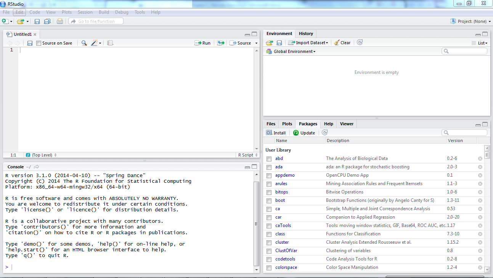

# R vs RStudio

## R vs RStudio

One of the first sticking points for a lot of people is figuring out the difference between `R` and `RStudio`. `R` is a free and open source programming language for statistical computing. `RStudio` is a free and open source integrated development environment (IDE) for `R`. `R` is the engine and can be interated with directly. `RStudio` is an interface through which we use `R` that provides a wide array of additional functionality to improve the user experience.

## R

If you open `R` you will be greeted with a rather basic interface. You can enter commands to run, but if you want to create a script to save the commands for an analysis you need to have a separate text editor program open. For your own research you are much better off interacting with `R` via the `RStudio` interface.

***

## RStudio

`RStudio` is a nicer interface to the `R` language that provides enhanced functionality. Upon opening `RStudio` you will be greeted with the typical four pane set-up.

The default layout of these four panes are:

+  Bottom left: This is the *Console*. This is equivalent to having an R session open and is where you can interactively run R code. You can run code here by pressing Enter/Return
+  Top left: This is the *Script Editor*. This is a text editor that allows you to write and save your code. You can run code here using either the Run button or Ctrl+Enter/Cmd+Return
+  Top Right: This is the *Environment*. This is where your saved variables are stored. You can also access the *History* tab to see your previously run commands
+  Bottom Right: This is the *Files*/*Plots*/*Packages*/*Help*/*Viewer* pane. At this stage the only things you need to know about this pane are that your generated plots show up here and, most importantly, you can go here for help.

## Work flow within RStudio

There are two main ways one can work within RStudio.

+  Test and play within the interactive `R` console then copy code into
  +  a `.R` file to run later. 
     +  This works well when doing small tests and initially starting off.
     +  It quickly becomes laborious
+  Start writing in an `.R` file and use `RStudio`'s command / short cut to push current line, selected lines or modified lines to the interactive `R` console. 
  +  This is a great way to start; all your code is saved for later
  +  You will be able to run the file you create from within `RStudio` or using `R`'s `source()` function.

