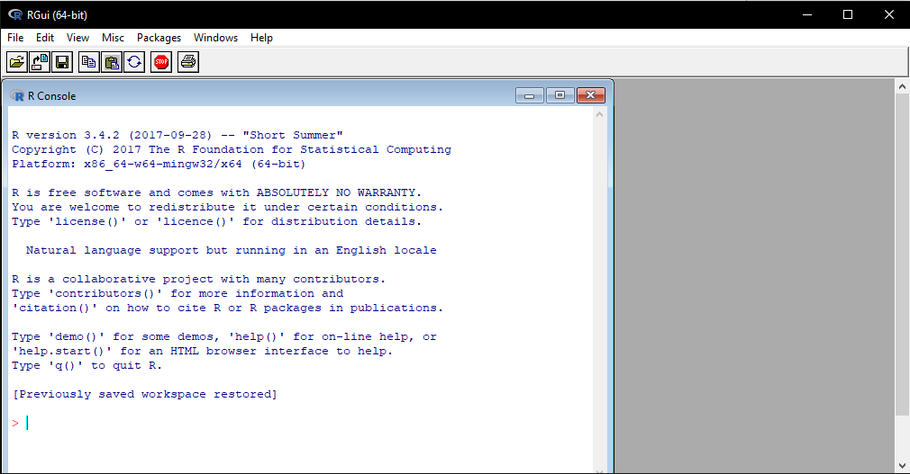
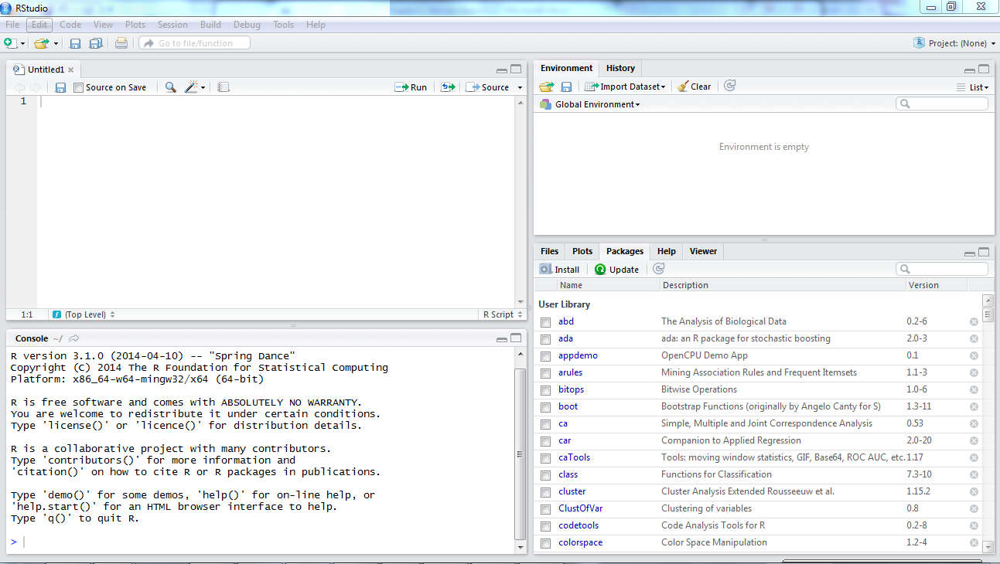

# Preamble

This is the course notes for the *Beginner's R Workshop* for the Ecology and Evolution PhD program joint venture of the School of BioSciences, School of Ecosystem and Forestry Science, and School of Geography. The goal of this workshop is to teach new PhD students how to use **R** for data analysis. **R** is a free, open-source programming language designed with statistical analysis in mind, and widely used throught many scientific disciplines. This workshop is designed to provide new PhD students in our three Schools with a strong foundation in **R**'s fundamentals to facilitate their own research projects.

This course will not assume any prior experience with **R**, but we recommend that attendees with no prior programming experience at all refer to the course material at [Introduction To Programming Concepts](https://nikkirubinstein.gitbooks.io/resguides-introductory-programming-concepts/content/content/welcome-to-coding.html) in advance. We will introduce these concepts during the workshop, but a basic understanding aforehand will help you get to grips with **R** faster. 

This material has been adapted with permission from Research Platforms Services's own [*Introductory R Workshop*](https://nikkirubinstein.gitbooks.io/resguides-introductory-r-workshop/content/) course material.

# Technical Requirements

All attendees will be required to **bring their own laptop and charger**. Tablets and/or Chromebooks (or similar) are not recommended. It can have a Windows, Mac, or Linux operating system, but you must have administrative priveleges.

Attendees are also asked to install both [**R**](https://www.r-project.org/) and [**RStudio**](https://www.rstudio.com/) in advance of the workshop. Both **R** and **RStudio** are updated regularly with both new features and bug fixes, so we require attendees to have **R** v3.4 or later, and **RStudio** v1.1.383 or later.

<!--chapter:end:index.Rmd-->

# R vs RStudio

<hr class="double">

## R vs RStudio

One of the first sticking points for a lot of people is figuring out the difference between `R` and `RStudio`. `R` is a free and open source programming language for statistical computing. `RStudio` is a free and open source integrated development environment (IDE) for `R`. `R` is the engine and can be interated with directly. `RStudio` is an interface through which we use `R` that provides a wide array of additional functionality to improve the user experience.

<hr class="small">

## R

If you open `R` you will be greeted with a rather basic interface. You can enter commands to run, but if you want to create a script to save the commands for an analysis you need to have a separate text editor program open. For your own research you are much better off interacting with `R` via the `RStudio` interface.


***

<hr class="small">

## RStudio

`RStudio` is a nicer interface to the `R` language that provides enhanced functionality. Upon opening `RStudio` you will be greeted with the typical four pane set-up.



The default layout of these four panes are:

+  Bottom left: This is the *Console*. This is equivalent to having an R session open and is where you can interactively run R code. You can run code here by pressing Enter/Return
+  Top left: This is the *Script Editor*. This is a text editor that allows you to write and save your code. You can run code here using either the Run button or Ctrl+Enter/Cmd+Return
+  Top Right: This is the *Environment*. This is where your saved variables are stored. You can also access the *History* tab to see your previously run commands
+  Bottom Right: This is the *Files*/*Plots*/*Packages*/*Help*/*Viewer* pane. At this stage the only things you need to know about this pane are that your generated plots show up here and, most importantly, you can go here for help.

<hr class="small">

## Work flow within RStudio

There are two main ways one can work within RStudio.

+  Test and play within the interactive `R` console then copy code into
  +  a `.R` file to run later. 
     +  This works well when doing small tests and initially starting off.
     +  It quickly becomes laborious
+  Start writing in an `.R` file and use `RStudio`'s command / short cut to push current line, selected lines or modified lines to the interactive `R` console. 
  +  This is a great way to start; all your code is saved for later
  +  You will be able to run the file you create from within `RStudio` or using `R`'s `source()` function.

<hr class="double">

<!--chapter:end:01-R_vs_RStudio.Rmd-->

# Project Set-up

<hr class="double">

## Introduction

Before we jump in to teaching how to code in `R` we're going to establish some programming *best practices*. These will not only make your programming experience proceed more smoothly, but most importantly you will thank yourself in six months for adopting them now when you have to revisit an older script and have to figure out *what* you did, *how* you did it, and *why* you did it that way. 

<hr class="small">

## Directory structures

It is best to keep all files associated with a given project (like a PhD chapter) located in a single root folder. This is commonly called a "one folder, one project" mentality, and has multiple benefits including:

+  Easy communication with collaborators (particularly in a version controlled environment)
+  A clear, easily navigatable directory structure makes finding specific files easier
+  You don't accidently lose an important file for your analysis because you kept it somewhere else

That said, there is no single best way to organise a file system. The key is to make sure that your chosen directory structure and the location of the files therein is consistent, informative, and, most importantly, works for you.

An example directory structure (for a `MyProject` root directory) might include the following:

+  A `data` folder that contains all input data (and associated metadata) for the analysis. This is then potentially split further into:
  +  A `raw` folder for your raw data files. These should never be modified so it is best to keep them separate.
  +  A `clean` folder for your cleaned up versions of your raw data files.
+  A `doc`  or `reports` folder for any manuscripts. This can include the manuscript submitted to a journal for publication, reports for a funding body like a government or NGO, or some markdown files documenting the steps of the analysis. You may wish to sub-divide this folder to include these different types or, alternatively, include both a `docs` and `reports` folder
+  A `figs` or `images` folder for any graphs and figures generated in the analysis
+  An `output` folder to store any type of intermediate or output files. This could include model objects, simulations, etc. Some people prefer to store their cleaned data here instead of in a sub-directory of `data`
+ A `scripts` folder to store the code scripts used in the analysis

```{r eval=FALSE}
###################
### Challenge 1 ###
###################

#Build your own project directory structure for this workshop. For our purposes today you will require at least a `data`, `scripts`, and `images` folder
```

<hr class="small">

## R Projects

R builds on the "one folder, one project" mentality with the creation of `R Projects`. An `R Project` serves as a self-contained environment for your entire analysis. Amongst other things, the benefits of an `R Project` are:

+  Relative file paths. The path to a file now only needs to be specified relative to the `R project` root directory. No more file paths going off the screen!
+  Maintain your environment between sessions. Normally, unless explicitly saved to file and re-loaded, your environment is lost between sessions. This means re-running your code again and again, which is unfeasible for larger analysis that may take hours or days to run. An `R project` will automatically save and re-load your environment.
+  Easy collaboration. A combination of the two above points means that you can send an `R project` directory to a colleague and the whole thing will run with no issue. This would otherwise require, at minimum, manually changing all file paths.
+  Version control. `RStudio` has an in-built point-and-click git interface that is only accessible when using an `R Project`.

You can either start an `R Project` from scratch by creating a new directory, or add `R Project` functionality to an existing directory. You can create an `R Project` from either the `File` menu in the top left of the screen, or from the `Project` menu in the top right.

```{r}
###################
### Challenge 2 ###
###################

# Add an `R Project` to the existing directory you created in Challenge 1. 
```

<hr class="small">

## Code script structures

A script is essentially a text file that `R` recognises as containing `R` code and providing it with syntax highlighting. You can run `R` commands in the `Console`, but there is no way of saving the commands you've used for future reference. Instead you can enter your commands in a script file to save them like any other document. Much like for directories, it is important to structure your code scripts. Without structure it is extremely difficult to return to an old script and figure out what you've done.

Just like there is no single correct way of structuring a directory, there is no single correct way of structuring a script. It is up to you to settle on a structure that works for you. Some things to consider using:

+  A title and "script abstract" at the top of the script saying what the script is for and how it does it.
+  Use headings/subheadings to make navigating between sections easier. These will obviously depend on what the script is doing, but common ones include `Load Packages`, `Load Data`, `Data Manipulation`, `Model Fitting`, `Plotting`, and `Save Outputs`.
+  Have any loaded packages called at the beginning of the script. This avoids some of the issues that may arise from function masking, and makes it easy for anyone else using the script to identify the packages they need to install.
+  Comment your code! Add comments to your code to remind you not only *what* you've done but *why* you've done it that way. If you come back to a script from six months ago it will be much easier to remember what you've done.

<hr class="small">

## Code style guides

Another thing that makes reading a code script easier is the use of a style guide. A style guide is essentially a series of self-imposed grammer/syntax rules to follow to write neat and human-readable code. Two commonly adopted ones are [Google's `R` style guide](https://google.github.io/styleguide/Rguide.xml) and [Hadley Wickham's `R` style guide](http://style.tidyverse.org/). You can also define your own by picking and choosing rules from different places. Some common things to consider:

+  Naming conventions. Be consistent with how you name variables, functions, etc. Many people implement a different style for variables and functions to help tell them apart. Some options are:
    +  camelCase
    +  PascalCase / UpperCamelCase
    +  snake_case
    +  snake.case.variant
    +  ALL_CAPS (normally reserved for constants)
+  `<-` instead of `=` for variable assignment
+  A line length of <80 characters. This is more of a rule of thumb not hard and fast, but the idea is to keep from having to scroll across to read a full command
+  Whitespace. `R` will ignore all whitespace in your code except for between a function name and it's opening parenthesis i.e. `mean (1,2)`, and inside object names. Make use of it to make the code readable (e.g. on either side of an operator `1 + 2`) but don't add it in unnecessarily.
+  Multi-line function calls. `R` recognises that a function call is not finished if the line ends in a comma, so you can add each argument in a function to a new line to make it fit on a page. E.g.
```{r eval=FALSE}
sum(1:100,
    na.rm = TRUE)
```

<hr class="small">

<!--chapter:end:02-Project_Set-up.Rmd-->

# Basic R

<hr class="double">

## Using R as a calculator

The simplest thing you could do with R is do arithmetic:

```{r}
1 + 100
```

If you type in an incomplete command, `R` will wait for you to complete it. If the symbol to the left of the bottom line in the console is `>` then `R` is ready to accept a new command, while a `+` means it is waiting for you to finsh the previous command.

If you want to cancel a command you can simply hit `Esc` and RStudio will give you back the ">" prompt (or `Ctrl+C` for a Mac). This is a useful tip to remember if you ever get stuck in a `+` loop in the console!

When using `R` as a calculator, the order of operations is the same as you would have learnt back in school.

From highest to lowest precedence:

+  Parentheses: `(`, `)`
+  Exponents: `^` or `**`
+  Divide: `/`
+  Multiply: `*`
+  Add: `+`
+  Subtract: `-`

```{r}
3 + 5 * 2
```

Use parentheses to group operations in order to force the order of evaluation if it differs from the default, or to make clear what you intend.

```{r}
(3 + 5) * 2
```

This can get unwieldy when not needed, but  clarifies your intentions. Remember that others may later read your code.

```{r, eval=FALSE}
(3 + (5 * (2 ^ 2))) # hard to read
3 + 5 * 2 ^ 2       # clear, if you remember the rules
3 + 5 * (2 ^ 2)     # if you forget some rules, this might help
```

The text after each line of code is called a "comment". Anything that follows after the hash (or octothorpe) symbol `#` is ignored by `R` when it executes code.

Really small or large numbers get a scientific notation:

```{r}
2/10000
```

Which is shorthand for "multiplied by `10^XX`". So `2e-4` is shorthand for `2 * 10^(-4)`.

You can write numbers in scientific notation too:

```{r}
5e3  # Note the lack of minus here
```

<hr class="small">

## Mathematical functions

`R` has many built in mathematical functions. To call a function, we simply type its name, followed by  open and closing parentheses. Anything we type inside the parentheses is called the function's arguments:

```{r}
sin(1)  # trigonometry functions
```

```{r}
log(1)  # natural logarithm
```

```{r}
log10(10) # base-10 logarithm
```

```{r}
exp(0.5) # e^(1/2)
```

Don't worry about trying to remember every function in `R`. You can simply look them up on google, or if you can remember the start of the function's name, use the tab completion in `RStudio`.

This is one advantage that `RStudio` has over `R` on its own, it has autocompletion abilities that allow you to more easily look up functions, their arguments, and the values that they take.

Typing a `?` before the name of a function will open the help page for that function. As well as providing a detailed description of the function  and how it works, scrolling to the bottom of the help page will usually show a collection of code examples which illustrate how to use it. We'll go through an example later.

<hr class="small">

## Comparing things

We can also do comparison in `R`:

```{r}
1 == 1  # equality (note two equals signs, read as "is equal to")
```

```{r}
1 != 2  # inequality (read as "is not equal to")
```

```{r}
1 <  2  # less than
```

```{r}
1 <= 1  # less than or equal to
```

```{r}
1 > 0  # greater than
```

```{r}
1 >= -9 # greater than or equal to
```

A word of warning about comparing numbers: you should never use `==` to compare two numbers unless they are integers (a data type which can specifically represent only whole numbers).

Computers may only represent decimal numbers with a certain degree of precision, so two numbers which look the same when printed out by `R`, may actually have different underlying representations and therefore be different by a small margin of error (called Machine numeric tolerance).

Instead you should use the `all.equal()` function.

<hr class="small">

## Variables and assignment

We can store values in variables using the assignment operator `<-`, like this:

```{r}
x <- 1
```

Notice that assignment does not print a value to the console. Instead, we stored it for later in something called a **variable**. `x` now contains the **value** `1`:

```{r}
x
```

Look for the `Environment` tab in one of the panes of `RStudio`, and you will see that `x` and its value have appeared. Our variable `x` can be used in place of a number in any calculation that expects a number:

```{r}
log(x)
```

Notice also that variables can be reassigned:

```{r}
x <- 100
```

`x` used to contain the value 1 and and now it has the value 100.

Assignment values can contain the variable being assigned to:

```{r}
x <- x + 1 #notice how RStudio updates its description of x on the top right tab
```

The right hand side of the assignment can be any valid `R` expression. The right hand side is *fully evaluated* before the assignment occurs.

Variable names can contain letters, numbers, underscores and periods. They cannot start with a number nor contain spaces at all. 

<hr class="small">

## Vectorisation

One final thing to be aware of is that `R` is *vectorised*, meaning that variables and functions can have vectors as values. For example:

```{r}
1:5
2^(1:5)
x <- 1:5
2^x
```

<hr class="small">

## Managing your environment

There are a few useful commands you can use to interact with the `R` session.

`ls()` will list all of the variables and functions stored in the global environment (your working R session):

```{r}
ls()
```

You can use `rm()` to delete objects you no longer need:

```{r}
rm(x)
```

If you have lots of things in your environment and want to delete all of them, you can pass the results of `ls()` to the `rm()` function:

```{r}
rm(list = ls())
```

In this case we've combined the two. Just like the order of operations, anything inside the innermost parentheses is evaluated first, and so on.

In this case we've specified that the results of `ls()` should be used for the `list` argument in `rm()`. When assigning values to arguments by name, you use the `=` operator!!

If instead we use `<-`, there will be unintended side effects, or you may just
get an error message:

```{r, error=TRUE}
rm(list <- ls())
```

Pay attention when `R` does something unexpected! Errors, like above, are thrown when R cannot proceed with a calculation. Warnings on the other hand usually mean that the function has run, but it probably hasn't worked as expected.

In both cases, the message that `R` prints out usually give you clues how to fix a problem.

<hr class="small">

## R Packages

It is possible to add functions to `R` by writing a package, or by obtaining a package written by someone else. As of this writing, there are over 7,000 packages available on CRAN (the comprehensive `R` archive network). `R` and `RStudio` have functionality for managing packages:

+  You can see what packages are installed by typing `installed.packages()`
+  You can install packages by typing `install.packages("packagename")`, where `packagename` is the package name, in quotes.
+  You can update installed packages by typing `update.packages()`
+  You can remove a package with `remove.packages("packagename")`
+  You can make a package available for use with `library(packagename)`

```{r}
###################
### Challenge 3 ###
###################

# Which of the following are valid variable names?

# min_height
# max.height
# _age
# .mass
# MaxLength
# min-length
# 2widths
# celsius2kelvin
```

```{r}
###################
### Challenge 4 ###
###################

# What will be the value of each  variable  after each statement in the following program?

# mass <- 47.5
# age <- 122
# mass <- mass * 2.3
# age <- age - 20
```

```{r}
###################
### Challenge 5 ###
###################

# Run the code from the previous challenge, and write a command to compare mass to age. Is mass larger than age?
```

```{r}
###################
### Challenge 6 ###
###################

#Clean up your working environment by deleting the mass and age variables.
```

```{r}
###################
### Challenge 7 ###
###################

# Install the following package: `ggplot2`
```

<!--chapter:end:03-Basic_R.Rmd-->

# Seeking Help

<hr class="double">

## Reading Help files

`R`, and every package, provide help files for functions. To search for help on a specific function that is in a package loaded into your namespace (your interactive `R` session):

```{r, eval=FALSE}
?function_name

help(function_name)

function_name  # Highlight the function name without parenthesis and press F1
```

This will load up a help page in `RStudio` (or as plain text in `R` by itself).

Each help page is broken down into sections:

+  Description: An extended description of what the function does.
+  Usage: The arguments of the function and their default values (if any).
+  Arguments: An explanation of the input each argument is expecting.
+  Details: Any important details to be aware of.
+  Value: The data the function returns.
+  See Also: Any related functions you might find useful.
+  Examples: Some examples for how to use the function.

Different functions might have different sections, but these are the main ones you should be aware of.

<hr class="small">

## Special Operators

To seek help on special operators, use quotes:

```{r, eval=FALSE}
?"+"
```

<hr class="small">

## Getting help on packages

Many packages come with "vignettes": tutorials and extended example documentation. Without any arguments, `vignette()` will list all vignettes for all installed packages; `vignette(package="package-name")` will list all available vignettes for`package-name`, and `vignette("vignette-name")` will open the specified vignette.

If a package doesn't have any vignettes, you can usually find help by typing
`help("package-name")`.

<hr class="small">

## When you kind of remember the function

If you're not sure what package a function is in, or how it's specifically spelled you can do a fuzzy search:

```{r, eval=FALSE}
??function_name
```

<hr class="small">

## When you have no idea where to begin

If you don't know what function or package you need to use [CRAN Task Views](http://cran.at.r-project.org/web/views) is a specially maintained list of packages grouped into fields. This can be a good starting point.

<hr class="small">

## When your code doesn't work: seeking help from your peers

If you're having trouble using a function, 9 times out of 10, the answers you are seeking have already been answered on [Stack Overflow](http://stackoverflow.com/). You can search using the `[r]` tag.

If you can't find the answer, there are a few useful functions to help you ask a question from your peers:

```{r, eval=FALSE}
?dput
```

Will dump the data you're working with into a format so that it can be copy and pasted by anyone else into their `R` session.

```{r}
sessionInfo()
```

Will print out your current version of `R`, as well as any packages you have loaded. This can be useful for others to help reproduce and debug your issue.

```{r}
###################
### Challenge 8 ###
###################

# Look at the help for the `paste` function. You'll need to use this later.  What is the difference between the `sep` and `collapse` arguments?
```

<hr class="small">

## Other ports of call

+  [Quick R](http://www.statmethods.net/)
+  [RStudio cheat sheets](http://www.rstudio.com/resources/cheatsheets/)
+  [Cookbook for R](http://www.cookbook-r.com/)

<hr class="small">

<!--chapter:end:04-Seeking_Help.Rmd-->

# Data in R

<hr class="double">

## Data Types

`R` can process a wide array of data types, but a key point to understand is that since it needs to handle different data types in different ways it will store them differently too.

There are 5 main data types:

+  doubles/numerics: standard numbers e.g. 3.14
+  integers: whole numbers *without* decimal places eg. 1 but not 1.0 (and written as `1L` to specify integer status)
+  complex: These you can pretty much ignore. This is dealing with things like imaginary numbers.
+  logical: These are boolean values of `TRUE` and `FALSE` that are encoded as `1` and `0` respectively
+  character: These are strings of text e.g. `word` or `this is a sentence`. When specifying these in `R` they need be be enclosed in quotation marks like `"word"` or `'word'`.

We can find the type of data something is stored as in `R` with the `typeof()` function, but for the majority of purposes it is better to know the *class* of data as that is the usual way `R` will communicate it to you. To do this we use the `class()` function:

```{r}
class(3.14)
class(1L)
class(1+1i)
class(TRUE)
class('banana')
```

<hr class="single">

## Type Coercion

Data types/classes are important because we need to handle different types of data differently. For exampe, we can add two numeric values together, or a numeric and an integer, but we can't add a numeric and a character together. `10 + "apple"` is nonsense, and `R` treats it that way. This enforced strictness is important, but it has some drawbacks to be aware of. The most important one is that all data in a single vector must be the same type. If you have a mix of values then everything will be converted to the "simplest" data type according to the following rule:

<center>**logical > integer > numeric > complex > character**</center>

A vector in `R` is essentially just an ordered list of things, with the special condition that *everything in the vector must be the same basic data type*. We can create a vector of values using the `c()` function:

```{r}
my_vec <- c(2,6,3)
my_vec
```

Given what we've learned so far, what do you think the following will produce?

```{r}
vec1 <- c(2,6,'3')
vec2 <- c("apple", 2.1, TRUE)
vec3 <- c(2, 2.0, 2L)
```

You can try to force coercion against this flow using the `as.*()` functions. Not everything is possible, but it useful to remember for if data is read in incorrectly by `R` (like numerics as a character string).

```{r}
as.numeric(c('0','2','4'))

as.logical(1)

as.logical(0)

as.logical(-0.5)

as.logical("house")
```

As you can see, some surprising things can happen when `R` forces one basic data type into another! Nitty-gritty of type coercion aside, the point is: if your data doesn't look like what you thought it was going to look like, type coercion may well be to blame.

<hr class="single">

## Data Structures

Now that we understand *data types* it is time to move on to the *data structures* that `R` uses to store data. The three data structures we will cover in this course are vectors, data frames, and lists. There are other data structures (like matrices and arrays) that we wont cover, but similar principles apply.

+  Vectors are a one-dimensional sequence of data elements. Every element in a vector must be the same data type or it will undergo type coercion
+  Lists are a collection of elements. Each element can be any type of `R` object (vector, data frame, a single value, even another list).
+  Data frames are a two-dimensional table of data elements. Each column is a vector (so must be the same data type), while each row is a list (so can contain different data types)

### Vectors

We've alredy covered how to create a basic vector, so now we will cover how to manipulate the vector.

The `c()` function can also append things to an existing vector:

```{r}
ab_vector <- c('a', 'b')
ab_vector

concat_example <- c(ab_vector, 'SWC')
concat_example
```

You can also create vectors of a series of numbers using more efficient methods. The `:` operator creates a vector of numbers from the first number to the second number by steps of 1.

```{r}
1:10

1.1:9.9
```

The `seq()` function lets you create a sequence of numbers with a specified step value:

```{r}
seq(from = 1,
    to = 10,
    by=0.1)
```

#### Vector Subsetting

To subset a vector we use what is known as square bracket notation `[]`. The individual elements in a vector are ordered, so we can call for specific elements directly by placing the index inside `[]`.

```{r}
my_vec <- c(1,3,5,6,10)

my_vec[3]

my_vec[c(2,4)]
```

Instead of asking for specific elements of a vector by index you can ask `R` to return any values that meet a specific criteria. We do this by placing a logical/boolean test in `[]` in place of an index.

```{r}
my_vec <- 1:10

my_vec[my_vec > 8]  # Return values > 8

my_vec[my_vec %% 2 == 0] # Return even numbers only
```

In addition to asking for elements of a vector with the square bracket notation, we can ask a few other questions about vectors:

```{r}
my_vec <- seq(0, 100, 0.1)

## Find out how long the vector is

length(my_vec)

## Show only the start of a vector

head(my_vec)

## Show only the end of a vector

tail(my_vec)
```

Finally, you can give names to elements in your vector and subset by those:

```{r}
name_vec <- 5:9

names(name_vec) <- c("a", "b", "c", "d", "e")

name_vec

name_vec["a"]

name_vec[c("a", "b")]
```

```{r}
###################
### Challenge 9 ###
###################

# Given the following lines of code:

x <- 1:5
names(x) <- letters[1:5]
x

# Find at least five different commands to come up with the following subset:

#  b  c  d
#  2  3  4

# Fictional bonus points for anyone who figures out the %in% operator!
```

## Lists

While everything in a vector has to be the same data type, a list is a really useful data structure to know since you can fill it with anything.

```{r}
list_example <- list(1, "a", TRUE, 1+4i)
list_example

another_list <- list(title = "Research Bazaar", numbers = 1:10, data = TRUE )
another_list
```

To subset a list we still use square bracket notation, but the syntax here can be confusing at first. Standard `[]` subsetting will return the specified element of a list as a list of one element rather than extracting the element itself. For example:

```{r}
another_list[1]
```

To extract the actual element of the list we need to use double bracket notation `[[]]` instead. Alternatively, in lists with named elements like this one you can call a specific list element by name with the `$` operator.

```{r}
another_list[[1]]

another_list$title
```

When you extracted the element of a list with double square bracket notation you can further subset it like you would normally with single bracket notation e.g. `[[]][]`. 

```{r}
####################
### Challenge 10 ###
####################

# Using the following code:

challenge_list <- list(words = c("alpha", "beta", "gamma"),
                       numbers = 1:10,
                       letter = letters)

challenge_list

# Extract the following things:
#   - The word "gamma"
#   - The letters "a", "e", "i", "o", and "u"
#   - The numbers less than or equal to 3

# More fictional bonus points if you use a different methods!
```

## Data Frames

Data frames are two-dimensional data structures and will probably be the most common one you use in your own analysis. Most functions for loading data into `R` from file (like `read.csv()`) will turn it into a `data.frame` by default.

Let's start by making a toy dataset in your `data/` directory, called `feline.csv`. Copy the following lines of data, open a new text file in `RStudio` with `File > New File > Text File`, paste the data, and save it to the appropriate directory.

```{r, eval=FALSE}
coat,weight,likes_string
calico,2.1,TRUE
black,5.0,FALSE
tabby,3.2,TRUE
```

We can load this into `R` via the following:

```{r}
cats <- read.csv(file = "data/feline-data.csv")
cats
```

Each column in a data frame is a vector (same data type), and each row is a list (different data types). We can look at the structure of a data frame using the `str()` function.

```{r}
str(cats)
```

We can begin exploring our dataset right away, pulling out columns and rows or combinations thereof. To extract a single column from the data you use the `$` operator with this syntax `data_name$column_name`.

```{r}
cats$weight
```

Since a column is a vector we can further subset this with `[]`:

```{r}
## Just the first element of the weight column

cats$weight[1]

## Just the second element of the weight column

cats$weight[2]

## Add the two previous values together

cats$weight[1] + cats$weight[2]
```

If we want to subset the full `cats` dataset then we need to specify the element/s we want to extract in two dimensions (rows and columns, in that order). This uses the following square bracket syntax `[row_id, column_id]`. If you want to subset in one dimension only and keep all of the other (e.g. first row of every column) then you just keep one dimension empty in the square brackets e.g. `[row_id, ]`. For example:

```{r}
## Extract the first row

cats[1, ]

## Extract the second column

cats[ , 2]

## Extract the value for the second row in the third column

cats[2, 3]
```

To highlight the difference vectors and lists, lets try and add a new row of data to the `cats` data frame.

```{r}
garfield <- c("marmalade", 20, FALSE)
garfield
```

If we create the new row as a vector then type coercion kicks in and we no longer have the data in the correct format! However, if we use a list:

```{r}
garfield <- list("marmalade", 20, FALSE)
garfield
```

To add a new row to a data frame we can use the `rbind()` (row bind) function.

```{r}
cats2 <- rbind(cats, garfield)
```

But now why didn't this work?

<hr class="single">

## Factors

Another important data structure is called a **factor**. Factors usually *look* like character data but are *stored* as integers with a look-up table. They are important for representing categorical information for statistical analysis. Lets take a closer look at the `coat` column using `str()`:

```{r echo=FALSE}
cats <- read.csv("data/feline.csv")
```

```{r}
str(cats$coat)
```

Factors make use of a look-up table to convert the numbers back to characters. In this case every `1` refers to `"calico"`. This means that you can't add new data that doesn't match the existing factor levels because `R` doesn't understand how to handle to data. It only knows what values correspond to 1,2, and 3. `"marmalade"` could be anything else! To get passed this we need to tell `R` that we want an extra factor level called `"marmalade"`, and we do this with the `levels()` command.

```{r}
# Existing levels

levels(cats$coat)

# Lets add a new level

levels(cats$coat) <- c(levels(cats$coat), "marmalade")

# Now lets see the new levels

levels(cats$coat)
```

While factors are essential for statistical modelling they can't be a nuisance in other instances. `R` will load all character data as factors by default, but we can tell it not to.

```{r}
####################
### Challenge 11 ###
####################

# Look thorugh the help file for the read.csv() command to find an argument to stop character data from being loaded as factors. Hint: Characters are sometimes referred to as strings.

# Reload the cats data frame from file without factors

# Add the new row of Garfield data to the data frame
```

<hr class="single">

```{r}
####################
### Challenge 12 ###
####################

# Create a list of length two containing a character vector for each of the sections in this part of the workshop:

# - Data types
# - Data structures

# Populate each character vector with the names of the data types and data structures we've seen so far.
```

<!--chapter:end:05-Data_in_R.Rmd-->

# Data Frame Manipulation

## Subsetting data

```{r, include=FALSE}
# Silently load in the data so the rest of the lesson works
titanic <- read.csv("https://goo.gl/4Gqsnz", header=TRUE)
```

Data frames are arguably the most common data structure you will work with in R for data analysis. We have previously covered some simple subsetting methods using `$` and `[ , ]` for extraction of specific elements, but what if we're only after elements that meet a set criteria? Trees above a certain height, species from a limited subset of taxa, only data points with no missing values?

These are all types of logical subsetting. `R` generates a vector of `TRUE` and `FALSE` values based on your set criteria and only returns that elements of your data frame that correspond to `TRUE` values.

For this section of the course we will be using a dataset about the passengers on the titanic. It is found online and you can download it with the following code:

```{r}
titanic <- read.csv("https://goo.gl/4Gqsnz", header=TRUE)
```

## Data Cleaning

One of the first steps of analysing a dataset is cleaning it up. As far as subsetting goes, it is often important to remove incomplete rows of data. Some times a particular observation is missing a measurement of a variable and this can cause issues:

```{r}
## Calculate the average age of passengers on the Titanic

mean(titanic$Age)

## Check for missing values

anyNA(titanic$Age)
```

Here, we can't calculate the average age of passengers on the titanic because we don't know the age of some passengers. Several summary statistic functions in `R` have a `na.rm` argument that lets you ignore `NA` values when performing the calculation:

```{r}
mean(titanic$Age, na.rm = TRUE)

mean(titanic$Survived, na.rm = TRUE)
```

But the two values above can't be fairly used in conjunction with each other. Why is that? 

Well it turns out that while we don't know the age of some of the passengers, we do know if each of them survived. This means we are summarising values from different data sets: the survival rate of *all* passengers, and the mean age of passengers *with known ages*. Unless the missing values have an identical distribution to the known values their absence will change the mean value. What if all of the unknowns are children? What if they are all >50?

This may seem somewhat trivial here, but if you are performing more elaborate statistical analyses like fitting linear models then it is crucial to ensure your datasets are identical. Models fit to two different datasets cannot be directly compared with model evaluation statistics like AIC, R^2^, AUC, etc. You can usually supply datasets with `NA`s to model fitting functoins in `R` but they will automatically drop rows with missing values **for covariates included in the model only**. This means that two models fit to the same data frame with different covariate combinations can actually be fit to different datasets and no longer comparable for model selection.

They key to avoiding this pitfall is to remove all `NA` values in advance. Conveniently, `R` makes this easy with the `na.omit()` function. Lets create a new data frame that is a version of `titanic` without missing values:

```{r}
titanic_clean <- na.omit(titanic)
```

## Logical Subsetting

### Single Criteria

You will often want to subset your data frame such that you only keep values that meet a certain criteria:

+  Only observations for a certain species
+  Only observations for all species *except* a certian species
+  Only observations for a specific geographic region
+  Only observations for specific gene locus

This is achieved by suppling a logical test in place of a particular index inside the `[ , ]` notation. This is going to be the subsetting of rows by values in a single column, so we put our logical test on the left of the `,` in `[ , ]`. Lets say we only want to keep the passengers who paid less than ten pounds for their ticket:

```{r}
titanic_cheap <- titanic_clean[titanic_clean$Fare < 10, ]

dim(titanic_cheap)
```

Here we have kept only the rows where the `Fare` column was < 10, and kept all columns (by leaving the column section blank). This reduced our dataset to a subset of only 236 passengers.

```{r}
####################
### Challenge 13 ###
####################

# Create a new data frame called titanic_35 that includes only the passengers aged 35 or under.
```

### Multiple Criteria

There are many situations in which you will wish to combine multiple logical criteria. 

+  All ecoregions that occur North of a certain latitude **and** West of a certain longitude 
+  All species that are mammals **or** birds **and** occur in Victoria
+  All gene loci identified with gene markers longer than X **and** less than Y

To do this we can just combine multiple logical tests in `R` using the *AND* `&` and *OR* `|` operators.

+  `&` returns `TRUE` if both the left and right are `TRUE`.
+  `|` returns `TRUE` if either the left or right (or both) are `TRUE`.

You may sometimes see `&&` and `||` instead of `&` and `|`. These operators only look at the first element of each vector and ignore the remaining elements. These operators are mainly used in programming, rather than data analysis and you can comfortably ignore them.

We supply multiple criteria tests to the `[ , ]` notation in this format: `<logical test> &/| <logical test>`. For example, lets keep only the passengers that were in first class and paid more than two hundred pounds for their ticket:

```{r}
titanic_rich <- titanic_clean[titanic_clean$Pclass == 1 & titanic_clean$Fare > 200, ]

dim(titanic_rich)
```

Only eighteen pasengers!

```{r}
####################
### Challenge 14 ###
####################

# Create a new data frame that includes only the passengers aged < 18 or >= 50.
```

```{r}
####################
### Challenge 15 ###
####################

# Create a new data frame that includes only female, third class passengers.
```

```{r}
####################
### Challenge 16 ###
####################

# Create a new data frame that includes only male passengers aged either 18, 23, 31, or 46.

# Hiint: Rememberthe %in% operator!
```

<!--chapter:end:06-Data_Frame_Manipulation.Rmd-->

# Data Visualisation

```{r, include=FALSE}
# Silently load in the data so the rest of the lesson works
titanic_clean <- na.omit(read.csv("https://goo.gl/4Gqsnz", header=TRUE))
```

## Creating publication quality graphics

Once you've completed your data analysis you're going to need to summarise it in some really nice figures for publication and/or presentations. This is where `R` can really shine in comparison to something like Excel.

While you can create plots through various, including base `R`, the most popular method of producing fancy figures is with the `ggplot2` package. First things first, if you haven't done so yet, we need to install the `ggplot2` package:

```{r eval=FALSE}
install.packages("ggplot2")
```

And load the package:

```{r}
library(ggplot2)
```

## Grammar of Graphics

`ggplot2` is built on the grammar of graphics concept: the idea that any plot can be expressed from the same set of components:

+  A **data** set
+  A **coordinate system**
+  A set of **geoms** - the visual representation of data points

The key to understanding `ggplot2` is thinking about a figure in layers. 

To start with we need to create the base layer for our plot. This is done with the `ggplot()` function, and it is here we define are **data** and **coordinate system** components. We set our **data** compnent using the `data` argument, and then use the aesthetic function `aes()` as a second argument to define our **coordinate system**. The `aes()` function can potentially be used multiple times when constructing our figure, so it is important to know that anything defined inside the base `ggplot()` function is a *global options* inherited by all subsequent layers. 

Time for an example:

```{r}
ggplot(data = titanic_clean,
       aes(x = Age,
           y = Fare))
```

Here we have said that `titanic_clean` is our **data** component, and to use `Age` on the x-axis and `Fare` on the y-axis for our **coordinate system**.

Now lets build onto this base layer by adding **geoms** to represent our data! `ggplot2` employs a really nice syntax where you can add subsequent layers using the `+` operator. This lets `R` know that the plot isn't finished yet and to add the new layer on top. In this case, we want to represent our data as a scatterplot so we use the `geom_point()` function.

```{r}
ggplot(data = titanic_clean,
       aes(x = Age,
           y = Fare)) +
  geom_point()
```

This plot isn't really telling us much! There are potentially confounding variables in play. What if we want to see the effect of another variable on the `Fare` ~ `Age` relationship? We can tell `R` to colour our points based on a third variable by setting the `col` argument in our global `aes()` call. Lets see what effect passenger class has:

```{r warning = FALSE}
ggplot(data = titanic_clean,
       aes(x = Age,
           y = Fare,
           col = as.factor(Pclass))) +
  geom_point()
```

We have used the `as.factor()` function on `Pclass` to ensure it is considered a discrete variable and not continuous for the colour scheme.

Now we can start to tease apart some trends from the data.

## Layers

Instead of a scatterplot We could also make a line plot. This time we will use `geom_line()` instead of `geom_point()`.

```{r warning = FALSE}
ggplot(data = titanic_clean,
       aes(x = Age,
           y = Fare,
           col = as.factor(Pclass))) +
  geom_line()
```

But what if we want to visualise both lines and points on the plot? We can simply add another layer to the plot:

```{r warning = FALSE}
ggplot(data = titanic_clean,
       aes(x = Age,
           y = Fare,
           col = as.factor(Pclass))) +
  geom_point() +
  geom_line()
```

It's important to note that each layer is drawn on top of the previous layer. In this example, the lines have been drawn *on top of* the points. Here's a demonstration:

```{r warning = FALSE}
ggplot(data = titanic_clean,
       aes(x = Age,
           y = Fare,
           col = as.factor(Pclass))) +
  geom_point(col="black") +
  geom_line()
```

```{r}
####################
### Challenge 17 ###
####################

# Switch the order of the point and line layers from the previous example. What happened?
```

## Transformations and statistics

`ggplot2` also makes it easy to overlay statistical models over the data. To demonstrate we'll go back to our first example:

```{r warning = FALSE}
ggplot(data = titanic_clean,
       aes(x = Age,
           y = Fare,
           col = as.factor(Pclass))) +
  geom_point()
```

We can fit a simple relationship to the data by adding another layer using `geom_smooth()`. We need to specify the `method` for modelling the relationship so lets use `lm` for a linear model.

```{r warning = FALSE}
ggplot(data = titanic_clean,
       aes(x = Age,
           y = Fare,
           col = as.factor(Pclass))) +
  geom_point() +
  geom_smooth(method = "lm")
```

Now we have plotted some linear models and their confidence intervals to show the relationships between `Fare` and `Age` for each `Pclass`, but it is hard to tell second and third class apart. To better view these relationships we can transform the y-axis to make it clearer. `ggplot2` has a variety of scaling functions that can be implemented, but in this case we want to log scale the y axis:

```{r warning = FALSE}
ggplot(data = titanic_clean,
       aes(x = Age,
           y = Fare,
           col = as.factor(Pclass))) +
  geom_point() +
  geom_smooth(method = "lm") +
  scale_y_log10()
```

Now we're at the point where we have a layer of the graph whose aesthetic characteristics are partially independent of the other layers: `geom_smooth()`. It has inherited the *global options* set by `aes()` in the `ggplot()` layer, but we can also change *local options* that only apply to the aesthetics of this layer. Depending on the layer in question these *local options* may be controlled with another `aes()` function and/or just with arguments to the function. 

```{r eval=FALSE}
####################
### Challenge 18 ###
####################

# Using the following base code:

ggplot(data = titanic_clean,
       aes(x = Age,
           y = Fare,
           col = as.factor(Pclass))) +
  geom_point() +
  geom_smooth(method = "lm") +
  scale_y_log10()

# Experiment with the additional options you can use to customise the `geom_oint()` and `geom_smooth()` layer. There is no set challenge, just experiment with different options. Consider changing the point/line size, transparency, linetype, etc
```

## Multi-panel figures

So far we have visualised the relationships between variables in a single plot. Alternatively, we can split out different groups in the data into multiple panels by adding a layer of **facet** panels. The `facet_grid()` and `facet_wrap()` layers do this wit slightly different amounts of control, but for now we can stick with `facet_grid()`. We need to specify which variable we want to split the plots by by supplying it as a formula like `~variable_name`.

This time lets look at the relationship `Sex` and `Survived` as a bar plot using `geom_bar()` (the `position = dodge` argument means have them side by side not stacked). First as a single plot:

```{r warning = FALSE}
ggplot(data = titanic_clean,
       aes(x = Sex,
           fill = as.factor(Survived))) +
  geom_bar(position = "dodge")
```

And now facetted by passenger class:

```{r warning = FALSE}
ggplot(data = titanic_clean,
       aes(x = Sex,
           fill = as.factor(Survived))) +
  geom_bar(position = "dodge") +
  facet_grid(~ Pclass)
```

## Further Customisation

Once the broad layout of your figure is settled on you can start to customise the more minor details of the figure to get it ready for publication. This includes things like changing labels, adding titles, fixing up the legend, adding themes and so on.

First, lets take a look at themes. Themes are a quick and easy way to make some big stylistic changes to a figure, and they just require adding on of `ggplot2`'s `theme_*()` layers.

```{r warning = FALSE}
ggplot(data = titanic_clean,
       aes(x = Sex,
           fill = as.factor(Survived))) +
  geom_bar(position = "dodge") +
  facet_grid(~ Pclass) +
  theme_bw()
```

Now lets add some more information (like units!) to our axis labels as well as a title. This involves a mix of the `xlab()`, `ylab()`, and `ggtitle()` functions.

```{r warning = FALSE}
ggplot(data = titanic_clean,
       aes(x = Sex,
           fill = as.factor(Survived))) +
  geom_bar(position = "dodge") +
  facet_grid(~ Pclass) +
  theme_bw() +
  xlab("Passenger age (in years)") +
  ylab("Number of passengers survived") +
  ggtitle("Titanic passenger survival rates")
```

Now lets clean up our facets so that they read "First class" etc instead of just the numeric data they are stored as. This requires the `labeller` argument and `labeller()` function inside our `facet_grid()` call:


To clean this figure up for a publication we need to change some of the text
elements. 

We can do this by adding a couple of different layers. The **theme** layer
controls the axis text, and overall text size, and there are special layers
for changing the axis labels. To change the legend title, we need to use the
**scales** layer.

```{r warning = FALSE}
ggplot(data = titanic_clean,
       aes(x = Sex,
           fill = as.factor(Survived))) +
  geom_bar(position = "dodge") +
  facet_grid(~ Pclass,
             labeller = labeller(Pclass = c(`1` = "First Class", 
                                                      `2` = "Second Class", 
                                                      `3` = "Third Class"))) +
  theme_bw() +
  xlab("Passenger age (in years)") +
  ylab("Number of passengers survived") +
  ggtitle("Titanic passenger survival rates")
```

And now lets tidy up the legend. How this is done will depend on the type of data being plotted, but it will be one of the various `scale_*()` functions. In our case we use `scale_fill_discrete()` since we have discrete data where the colour is filled by this third variable. 

```{r warning = FALSE}
ggplot(data = titanic_clean,
       aes(x = Sex,
           fill = as.factor(Survived))) +
  geom_bar(position = "dodge") +
  facet_grid(~ Pclass,
             labeller = labeller(Pclass = c(`1` = "First Class", 
                                                      `2` = "Second Class", 
                                                      `3` = "Third Class"))) +
  theme_bw() +
  xlab("Passenger age (in years)") +
  ylab("Number of passengers survived") +
  ggtitle("Titanic passenger survival rates") +
  scale_fill_discrete(name = "Survival",
                      label = c("Died", "Survived"))
```

## Saving Plots

Once you have a finished plot you will want to save it to file from `R` so that you can embed it in your document of choice. The easiest option is to use the `ggsave()` function that by default saves the last plot from your `Plot` tab to file using the current size of the graphics device, but you can set your own `height`, `width`, and `units` arguments.

```{r eval=FALSE}
ggsave("images/My_Plot.jpg")

ggsave("images/My_Plot.jpg",
       height = 10,
       width = 15,
       units = "cm")
```

An alternative is to use one of the variety of image file creation functions available in `R` like `png()`, `jpeg()`, or `pdf()`. These functions will open a new file of that specific type, add to it anything that you plot, and then needs to be specifically told to close and save the file using the `dev.off()` function. This is the ideal method of doing so since it gives you greater control over the file generation process, including the ability to save multiple plots to a single file (depending on file type chosen). Unless you have a **very** good reason why not to, always use the `pdf()` function here for plots since it saves as a vector graphic so it can be rescaled in the future without pixellation problems.

```{r eval=FALSE}
pdf("images/My_Plot.pdf",
    width = 10,
    height = 6)

ggplot(data = titanic_clean,
       aes(x = Sex,
           fill = as.factor(Survived))) +
  geom_bar(position = "dodge") +
  facet_grid(~ Pclass,
             labeller = labeller(Pclass = c(`1` = "First Class", 
                                                      `2` = "Second Class", 
                                                      `3` = "Third Class"))) +
  theme_bw() +
  xlab("Passenger age (in years)") +
  ylab("Number of passengers survived") +
  ggtitle("Titanic passenger survival rates") +
  scale_fill_discrete(name = "Survival",
                      label = c("Died", "Survived"))

dev.off()
```

Alternatively if you have saved your plot in your environment as the variable `my_plot`:

```{r eval=FALSE}
pdf("images/My_Plot.pdf",
    width = 10,
    height = 6)

my_plot

dev.off()
```

```{r eval=FALSE}
####################
### Challenge 19 ###
####################

# This is the final challenge of the course and the ONLY assessed component.
#
# Plot the titanic_clean dataset in any way you wish. Customise the plot to your heart's content! If you're lacking inspiration try some of these:
#
# - Change the variables on the axis
# - Change line/point widths/clours/transparency
# - Change the title and axis labels
# - Use a theme!
# - Facet the data
# - Change the colours!
#
# If you have ideas and don't know how to do it ask a helper!
#
# Save the plot to a pdf file in your images/ directory
#
# Show the plot in the file to a helper to get a tick next to your name on the assessment list. We don't care what it looks like as long as the pdf has a plot in it! Make it as pretty or ugly as you wish!
```

<!--chapter:end:07-Data_Visualisation.Rmd-->

# Saving Data/Outputs

<!--chapter:end:08-Saving_Data_Outputs.Rmd-->

